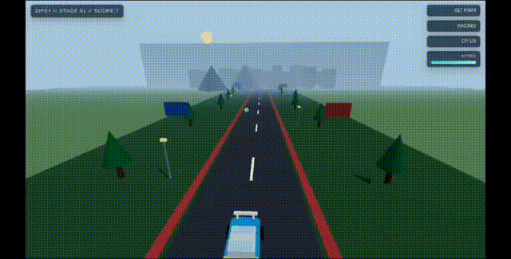
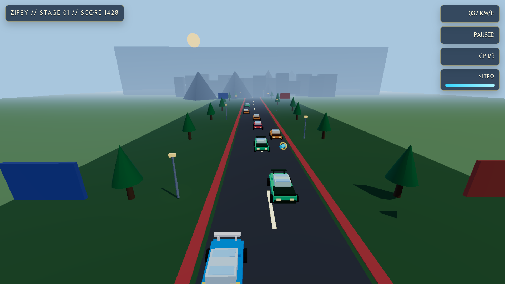
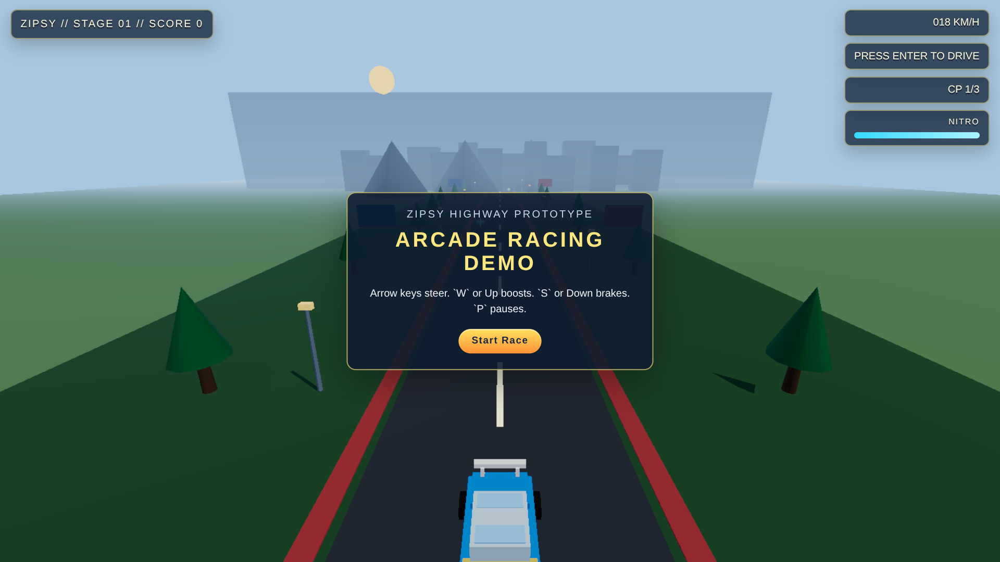
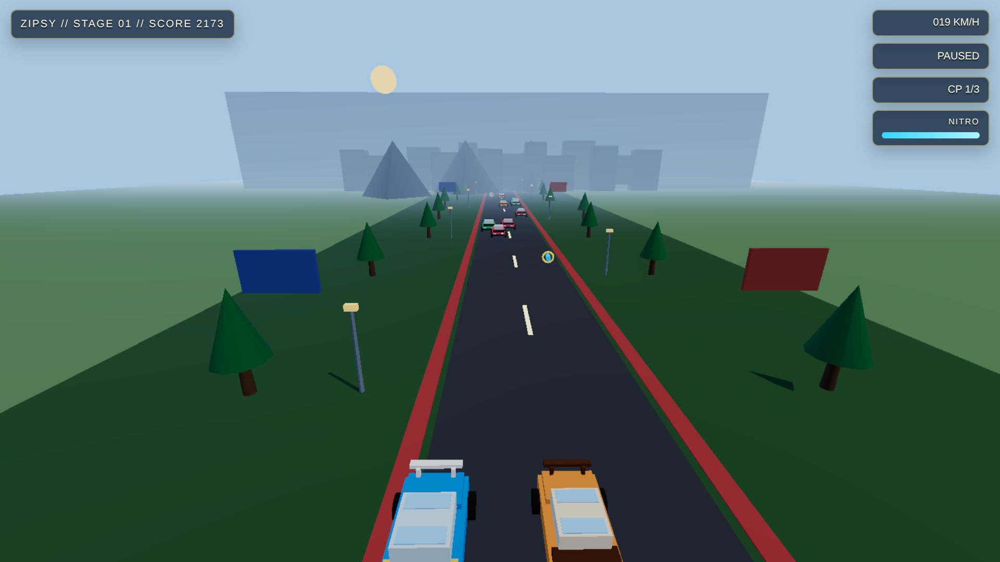
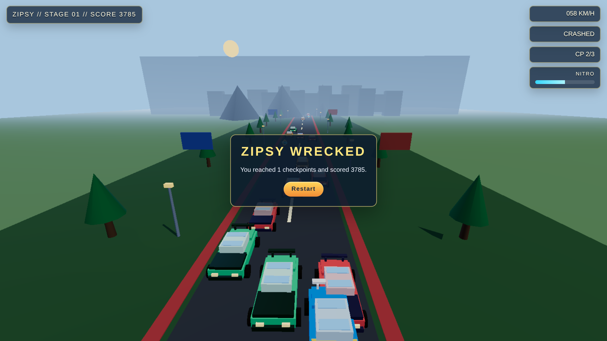

# RFPC

## V1.0

## About 

`RFPC` is a 3D arcade racing prototype built with `Three.js`, bundled with `Vite`, and packaged for desktop with `Electron`.



### Screenshots







The current game includes:
- a playable 3D racing scene
- a procedural fallback car named `Zipsy`
- support for imported `.glb` car and skyline assets
- boost, brake, checkpoint, traffic, and nitro pickup systems
- browser development through Vite and desktop play through Electron

## Tech Stack

- `Three.js` for rendering and scene logic
- `Vite` for frontend development and production build output
- `Electron` for desktop window packaging

## Requirements

- `Node.js` 18+ recommended
- `npm`

## Install

```bash
npm install
```

## Run

### Vite development server

Use this for fast frontend iteration in the browser:

```bash
npm run dev
```

Vite serves the app from source files such as `index.html`, `style.css`, and `src/main.js`.

### Electron desktop app

Use this when you want the desktop window:

```bash
npm start
```

What `npm start` does:
1. runs `vite build`
2. outputs the frontend into `dist/`
3. opens Electron, which loads `dist/index.html`

### Production build only

```bash
npm run build
```

## Controls

- `Left Arrow`: steer left
- `Right Arrow`: steer right
- `Up Arrow` or `W`: boost
- `Down Arrow` or `S`: brake
- `Enter`: start race
- `P`: pause or resume
- `Restart` button: restart after crash or stage end

## Asset Setup

Imported 3D models are optional right now. If they are missing, the game falls back to procedural geometry.

Drop `.glb` files in:

```text
assets/models/
```

Recommended filenames:

- `zipsy.glb`
- `traffic-sport.glb`
- `traffic-suv.glb`
- `traffic-coupe.glb`
- `city-tower-a.glb`
- `city-tower-b.glb`
- `city-billboard.glb`

The loader paths are defined in `src/assets/AssetCatalog.js` and `src/assets/ModelLibrary.js`.

## Directory Structure

```text
RFPC/
├── assets/
│   ├── models/             # Optional imported .glb assets
│   └── sounds/             # Engine and crash audio
├── src/
│   ├── assets/             # Asset catalog and model-loading helpers
│   ├── core/               # Scene, camera, renderer setup
│   ├── entities/           # Player/enemy car creation
│   ├── systems/            # Input, audio, nitro, checkpoints, traffic, camera rig
│   ├── utils/              # Shared gameplay constants
│   ├── world/              # Road and environment generation
│   └── main.js             # Main game bootstrap and loop
├── dist/                   # Built frontend output from Vite
├── index.html              # Frontend HTML entry
├── style.css               # UI and overlay styling
├── index.js                # Electron main process entry
├── preload.js              # Electron preload bridge
├── package.json            # Scripts and dependencies
└── vite.config.js          # Vite config
```

## Game Flow

At a high level, the game runs like this:

1. `src/main.js` creates the scene, camera, renderer, UI bindings, and gameplay systems.
2. The world is built by `src/world/Environment.js` and `src/world/Road.js`.
3. The player car is created in `src/entities/PlayerCar.js`.
4. Enemy traffic is spawned from `src/entities/EnemyCar.js`.
5. Input, camera follow, audio, nitro, checkpoints, and traffic behavior update every animation frame.
6. The renderer draws the frame with post-processing.
7. The game ends on either:
   - collision with enemy traffic
   - stage completion after all checkpoints are cleared

### In-game loop

- Start screen waits for `Enter` or the start button.
- Race begins and the engine audio starts.
- The player steers, boosts, brakes, avoids traffic, and collects nitro pickups.
- Checkpoints advance stage progress.
- On crash, the game over panel appears.
- On final checkpoint, the stage clear panel appears.

## Code Overview

### Frontend entry

- `src/main.js`
  - bootstraps the entire game
  - wires DOM HUD elements
  - runs the main animation loop
  - handles spawn timing, score, speed, pause/start state, checkpoints, and game over

### Core rendering

- `src/core/Scene.js`
  - creates the Three.js scene and fog
- `src/core/Camera.js`
  - creates the perspective camera
- `src/core/Renderer.js`
  - sets up WebGL renderer, tone mapping, shadows, and bloom post-processing

### Entities

- `src/entities/CarFactory.js`
  - builds low-poly arcade car geometry used as procedural fallback
- `src/entities/PlayerCar.js`
  - creates the player car and tries to load `zipsy.glb`
- `src/entities/EnemyCar.js`
  - creates enemy traffic and tries to load imported traffic car assets

### World

- `src/world/Road.js`
  - builds the repeating road, lane markers, roadside props, and nitro pickups
- `src/world/Environment.js`
  - builds the lighting, skyline, mountains, trees, lamp posts, and far ground

### Systems

- `src/systems/InputSystem.js`
  - keyboard input state
- `src/systems/AudioSystem.js`
  - engine and crash audio control
- `src/systems/CameraRig.js`
  - smooth camera follow behavior
- `src/systems/CollisionSystem.js`
  - player/enemy collision checks
- `src/systems/CheckpointSystem.js`
  - stage progress and checkpoint tracking
- `src/systems/NitroSystem.js`
  - boost resource drain and recharge
- `src/systems/TrafficSystem.js`
  - enemy lane-change behavior

### Asset pipeline

- `src/assets/AssetCatalog.js`
  - canonical names for expected imported assets
- `src/assets/ModelLibrary.js`
  - cached GLTF loading for car and environment models

### Shared constants

- `src/utils/Constants.js`
  - gameplay tuning values such as speed, nitro, checkpoints, and spawn intervals

## Electron + Vite Integration

The project uses a simple split:

- `Vite` handles the frontend app and outputs static files to `dist/`
- `Electron` opens the built app from `dist/index.html`

Key files:

- `index.js`: Electron main process, creates the desktop window
- `preload.js`: preload bridge for safe renderer exposure
- `vite.config.js`: uses `base: './'` so built assets work when loaded via Electron `file://`

## Notes

- `npm run dev` is for browser-based development.
- `npm start` is for the desktop Electron window.
- If imported models are not present, the game still works with procedural art.
- The built bundle is currently large because `three`, post-processing, and loaders are included in a single client chunk.
